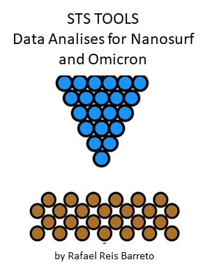

<p align="center">
  
</p>

<h1 align="center">STSTools</h1>
<p align="center"><strong>Data Analysis for STS Measurements from Nanosurf, Omicron, and Nanonis</strong></p>

---

## 🧪 What is STSTools?

**STSTools** is a Python library for analyzing and visualizing Scanning Tunneling Spectroscopy (STS) data from:

- 🧬 **Nanosurf**: `.nid` files
- ⚛️ **Omicron v6.4.0**: `.txt`, `.ibw` (IGOR grid maps)
- 🧲 **Nanonis**: `.dat` files

Built to help researchers process, inspect, and interpret I(V) spectra and grid maps through an intuitive Jupyter-based interface.

> ⚠️ *Important: Do not rename exported `.ibw` or `.dat` files — file structure is metadata-dependent.*

---

## 📦 Installation

### 🔹 From PyPI (recommended)

```bash
pip install ststools
```

### 🔹 From source (development mode)

```bash
git clone https://github.com/rafinhareis/STSTools.git
cd STSTools
pip install -e .
```

---

## 🚀 Getting Started

Simply import `ststools` in a Jupyter notebook — the main interface will launch automatically:

```python
import ststools
```

You’ll see options to load STS or grid files, define grid size, and start visualizing your data interactively — without needing to write custom scripts.

---

## ✍️ Author

Developed and maintained by **Rafael dos Reis Barreto**  
📧 Contact: rafinhareis17@gmail.com  
📦 PyPI: [https://pypi.org/project/ststools](https://pypi.org/project/ststools/)  
💻 GitHub: [https://github.com/rafinhareis/STSTools](https://github.com/rafinhareis/STSTools)

> ❤️ If this tool helps you in your research, feel free to cite or mention me in your paper =D

---

## 📜 License

MIT License — feel free to use, fork and improve.
